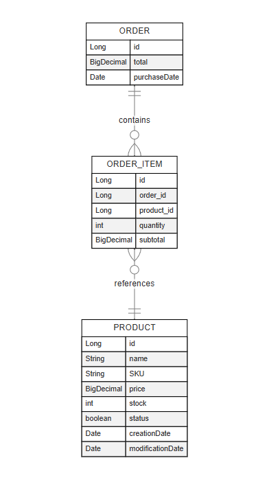

# Sistema de Gestão de Produtos e Pedidos

## Descrição
Este projeto é um sistema de gestão de produtos e pedidos desenvolvido em Java 17+. Ele permite que os usuários gerenciem produtos e pedidos de forma eficiente, incluindo funcionalidades para criar, atualizar e recuperar pedidos e produtos.

## Funcionalidades do Projeto

### Gerenciamento de Produtos

- 🆕 **Criar Produto:** Permite a criação de novos produtos no sistema.
- 🔄 **Atualizar Produto:** Permite a atualização das informações de um produto existente.
- 🔍 **Recuperar Produto por Nome:** Permite a busca de um produto pelo seu nome.
- 🔍 **Recuperar Produto por SKU:** Permite a busca de um produto pelo seu SKU.
- 🗑️ **Deletar Produto:** Permite a exclusão de um produto do sistema.
- 🔄 **Atualizar Status do Produto:** Permite a atualização do status (ativo/inativo) de um produto.

### Gerenciamento de Pedidos

- 🆕 **Criar Pedido:** Permite a criação de novos pedidos no sistema.
- 🔍 **Recuperar Pedido por ID:** Permite a busca de um pedido pelo seu ID.
- 🔍 **Recuperar Pedidos por SKU do Produto:** Permite a busca de pedidos que contenham um produto específico pelo seu SKU.

## Diagrama ER do Banco de Dados
O diagrama Mermaid representa um modelo de banco de dados relacional com três tabelas: `ORDER`, `ORDER_ITEM` e `PRODUCT`.



- A tabela `ORDER` contém informações sobre pedidos, incluindo o ID do pedido, valor total e data da compra.
- A tabela `ORDER_ITEM` contém detalhes sobre itens individuais dentro de um pedido, incluindo o ID do item, ID do pedido (chave estrangeira), ID do produto (chave estrangeira), quantidade e subtotal.
- A tabela `PRODUCT` contém informações sobre produtos, incluindo o ID do produto, nome, SKU, preço, estoque, status, data de criação e data de modificação.

As relações entre essas tabelas são as seguintes:
- Um `ORDER` pode conter múltiplas entradas de `ORDER_ITEM`, indicando que um pedido pode ter vários itens.
- Cada `ORDER_ITEM` referencia um único `PRODUCT`, indicando que cada item em um pedido corresponde a um produto específico.

## Tecnologias Utilizadas
-  **Java 17+**
-  **Spring Boot**
-  **Maven**

## Começando

### Pré-requisitos
Liste o software e as ferramentas que precisam ser instalados antes de configurar o projeto.
-  **Java 17+**
-  **Spring Boot**
-  **Maven**
### Instalação
Passos para configurar o projeto localmente:
1. Clone o repositório:
    ```sh
    git clone https://github.com/Filipescordeiro2/project-prodify.git
    ```
2. Navegue até o diretório do projeto:
    ```sh
    cd project-prodify
    ```
3. Construa o projeto usando Maven:
    ```sh
    mvn clean install
    ```

### Executando a Aplicação
Instruções para executar a aplicação:
1. Inicie a aplicação Spring Boot:
    ```sh
    mvn spring-boot:run
    ```

## API Endpoints

### OrderController

#### Criar Pedido
**Endpoint:** `POST /orders`

**Request JSON:**
```json
{
  "items": [
    {
      "productId": 1,
      "quantity": 2
    }
  ]
}
```

### ProductController

#### Criar Produto
**Endpoint:** `POST /products`

**Request JSON:**
```json
{
  "name": "Product Name",
  "price": 50.00,
  "stock": 100
}
```

**Response JSON:**
```json
{
  "message": "Product created successfully",
  "name": "Product Name",
  "price": 50.00,
  "stock": 100,
  "creationDate": "2025-02-02T19:32:11.2839509",
  "modificationDate": "2025-02-02T19:32:11.2839509",
  "status": true,
  "sku": "41c8d18d"
}
```

### Orders

#### Criar Pedido

**Request:**

`http://localhost:8080/orders`

**Request Body:**
```json
{
  "items": [
    {
      "productId": "1",
      "quantity": 1
    }
  ]
}
```

**Response:**
```json
{
  "message": "Order created successfully",
  "id": 1,
  "items": [
    {
      "sku": "dae1b6fa",
      "quantity": 1,
      "productName": "Product Name",
      "subtotal": 50.00
    }
  ],
  "total": 50.00,
  "purchaseDate": "2025-02-02T19:51:25.0441231"
}
```

#### Criar Pedido com Múltiplos Produtos

**Request Body:**
```json
{
  "items": [
    {
      "productId": "3",
      "quantity": 2
    },
    {
      "productId": "4",
      "quantity": 5
    }
  ]
}
```

**Response:**
```json
{
  "message": "Order created successfully",
  "id": 2,
  "items": [
    {
      "sku": "dae1b6fa",
      "quantity": 2,
      "productName": "Product Name",
      "subtotal": 100.00
    },
    {
      "sku": "c8f15232",
      "quantity": 5,
      "productName": "Product Name 2",
      "subtotal": 250.00
    }
  ],
  "total": 350.00,
  "purchaseDate": "2025-02-02T19:52:22.9709112"
}
```

#### Buscar Pedido por SKU

**Request:**

`http://localhost:8080/orders/SKU/{sku}`

**Exemplo:**

`http://localhost:8080/orders/SKU/dae1b6fa`

**Response:**
```json
{
  "content": [
    {
      "message": "Orders found successfully",
      "id": 1,
      "items": [
        {
          "sku": "dae1b6fa",
          "quantity": 1,
          "productName": "Product Name",
          "subtotal": 50.00
        }
      ],
      "total": 50.00,
      "purchaseDate": "2025-02-02T19:51:25.044123"
    }
  ],
  "totalElements": 1
}
```
# Criador

** Filipe Santana Cordeiro **
 ** Desenvolvedor Beck End **  


